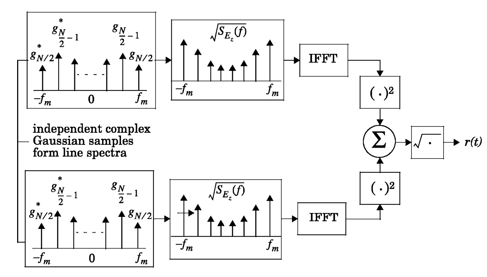
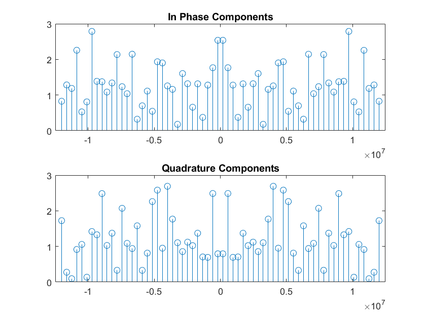
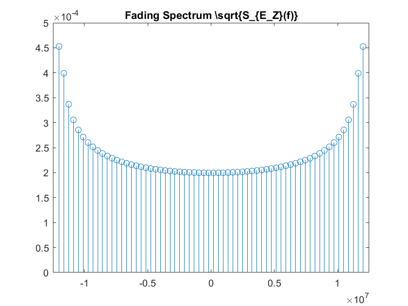
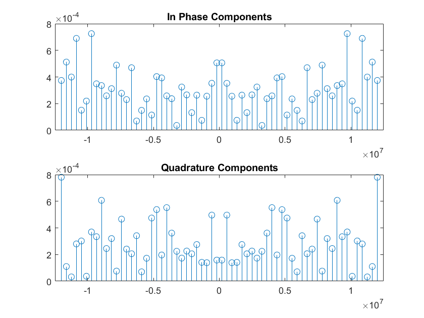
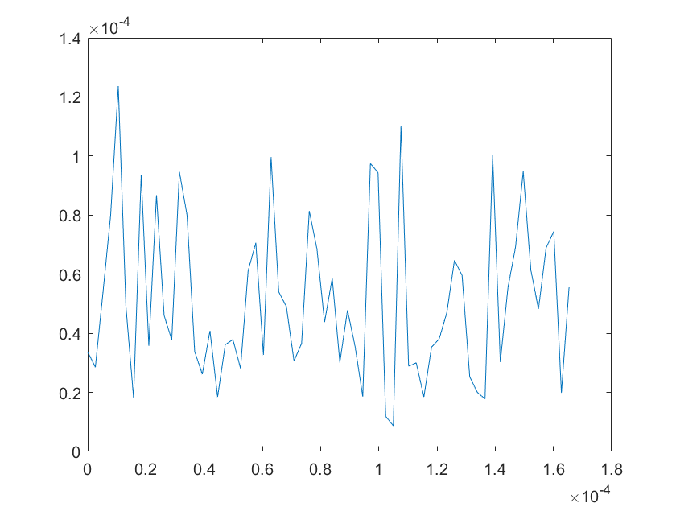
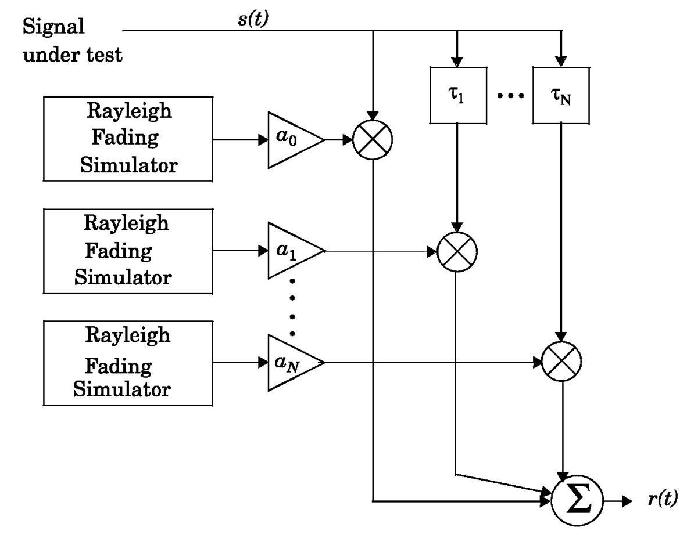
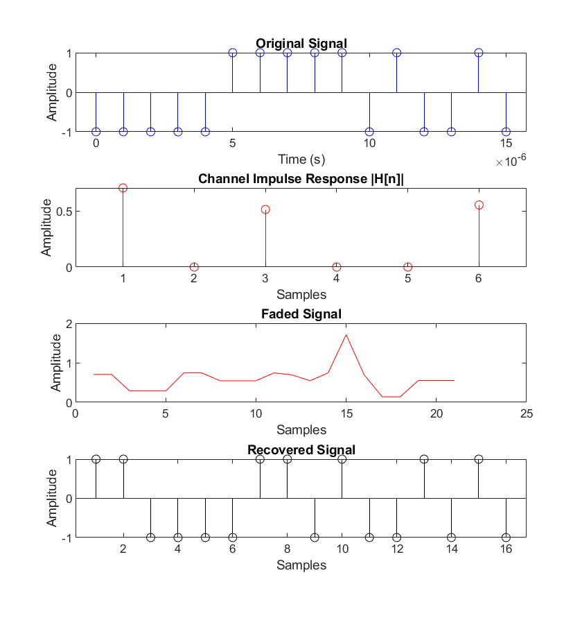
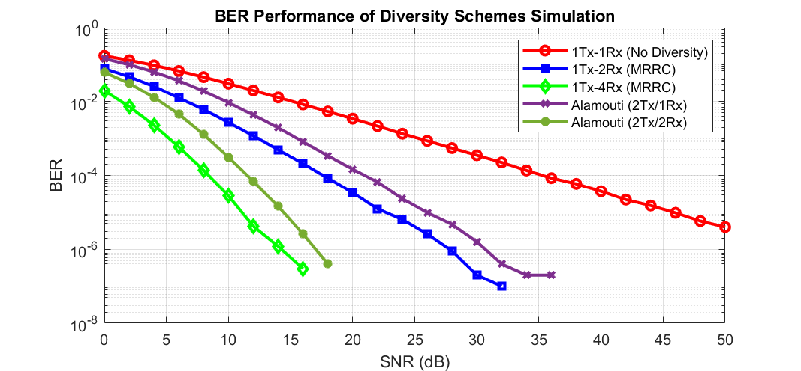

# Diversity Schemes for Noise Resilience in Multipath Scenarios

## Overview

This project evaluates the performance of several **antenna diversity schemes** under multipath Rayleigh fading channels. We implement and compare:

* **1Tx/1Rx** (No Diversity)
* **1Tx/2Rx (MRRC)**
* **1Tx/4Rx (MRRC)**
* **2Tx/1Rx (Alamouti STBC)**
* **2Tx/2Rx (Alamouti STBC)**

The simulations confirm theoretical diversity gains, demonstrating that both **Maximal Ratio Receiver Combining (MRRC)** and **Alamouti Space-Time Block Coding (STBC)** significantly improve **Bit Error Rate (BER)** performance in fading environments.

## Background

Wireless channels suffer from **multipath fading**, which increases BER and reduces reliability. Diversity techniques mitigate fading:

* **MRRC**: Combines signals across multiple receive antennas to maximize SNR.
* **Alamouti STBC**: Transmit diversity by encoding symbols across two antennas with orthogonal design.

The Rayleigh fading model is used to represent realistic channel conditions.

## Methods

### Rayleigh Fading Simulator

We implemented the Rayleigh fading channel using **Smith’s algorithm**. A flat-fading envelope is generated from Gaussian samples, shaped by the Doppler spectrum:

  

**Original Gaussian samples (64-point):**

  

**Fading Spectrum:**

$$
S_{E_Z}(f) = \frac{1.5}{\pi f_m \sqrt{1 - \left(\frac{f}{f_m}\right)^2}}
$$

  

**Spectrum shaping effect:**

  

**Final envelope (flat Rayleigh fading):**

  

### Frequency-Selective Rayleigh Fading

Instead of convolution, time delays are mapped to random phase shifts:

$$
\tau_n \;\longrightarrow\; e^{-j\theta_n}
$$

The channel is modeled as:

$$
r(t) = h s(t)
$$

$$
h = \alpha_0 e^{-j\theta_0} + \alpha_1 e^{-j\theta_1} + \alpha_2 e^{-j\theta_2} + \dots
$$

  

### Alternate FIR Filter Approach

A convolution-based FIR filter model was attempted but introduced significant **group delay**:

  

This approach was abandoned in favor of the phase-mapping method.

### Signal Model

The received signal:

$$
y = hx + n
$$

* $x$: transmitted BPSK symbol
* $h$: Rayleigh fading coefficient
* $n$: complex Gaussian noise

### MRRC Implementation

For $N_r$ receive antennas, the combined symbol estimate is:

$$
\hat{x} = \frac{\sum_{i=1}^{N_r} h_i^* y_i}{\sum_{i=1}^{N_r} |h_i|^2}
$$

### Alamouti STBC

The transmit block:

$$
X =
\begin{bmatrix}
x_1 & x_2 \\
-x_2^* & x_1^*
\end{bmatrix}
$$

At the receiver:

$$
\hat{x_1} = h_1^* y_1 + h_2 y_2^*
$$

$$
\hat{x_2} = h_2^* y_1 - h_1 y_2^*
$$

## Results

The BER performance for each scheme is shown below:

  

* **1Tx/1Rx**: Highest BER (baseline, no diversity).
* **MRRC**: Significant BER improvements with increasing Rx antennas.
* **Alamouti STBC**: Slightly lower performance due to 3 dB power split, but still strong diversity gain.

## References

* T.S. Rappaport, *Wireless Communications: Principles and Practice*, 2nd ed., Prentice Hall, 2002.
